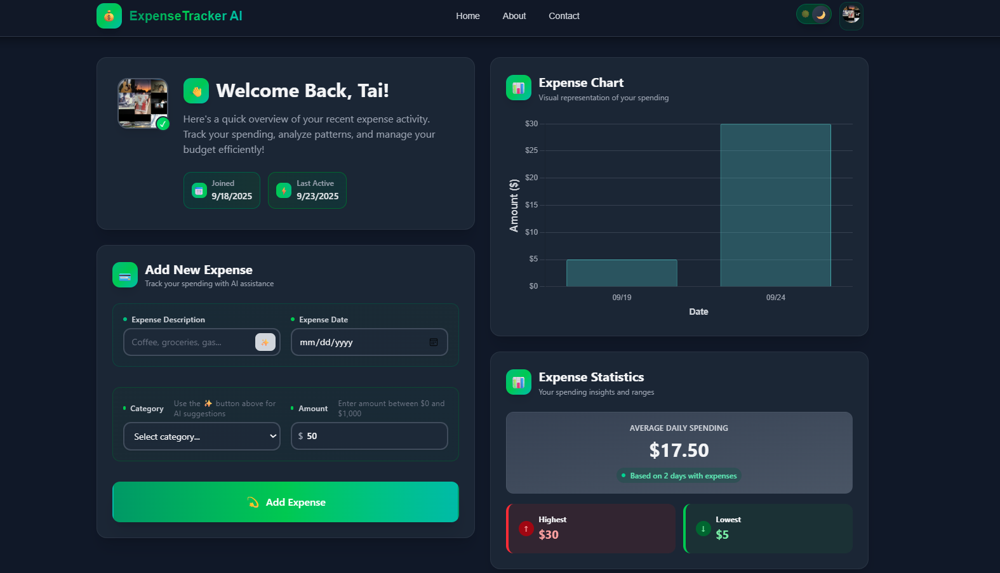
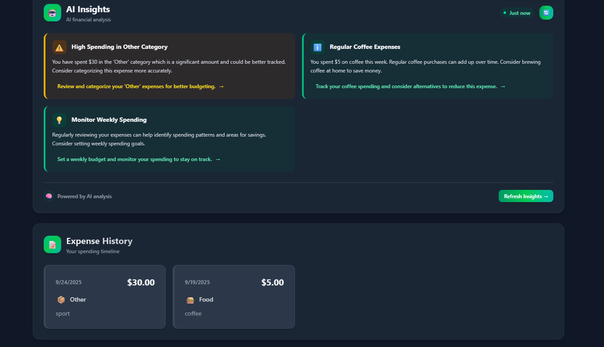

# 💰 Expense Tracker AI  

AI-powered Expense Tracker giúp bạn quản lý chi tiêu thông minh với phân loại tự động, biểu đồ trực quan, và đăng nhập an toàn.  

🔗 **Demo:** [Expense Tracker AI](https://next-expense-tracker-ai-zzs3.vercel.app)  
📂 **Source Code:** [GitHub Repo](https://github.com/NguyenTanTai76/next-expense-tracker-ai)  

---

## 🚀 Features  

- 🤖 **AI-powered categorization** – Tự động phân loại chi tiêu bằng AI  
- 🔐 **Secure authentication** – Đăng nhập/đăng ký với [Clerk](https://clerk.com)  
- 📊 **Charts & insights** – Phân tích chi tiêu bằng biểu đồ trực quan  
- 📱 **Responsive design** – Tương thích trên mọi thiết bị  

---

## 🛠️ Tech Stack  

- **Frontend:** [Next.js](https://nextjs.org), [Tailwind CSS](https://tailwindcss.com)  
- **Database:** [Neon (PostgreSQL)](https://neon.tech)  
- **Authentication:** [Clerk](https://clerk.com)  
- **AI Integration:** [OpenRouter API](https://openrouter.ai)  

---

## ⚙️ Getting Started  

### 1. Clone project  

git clone https://github.com/NguyenTanTai76/next-expense-tracker-ai.git
cd next-expense-tracker-ai

### 2. Install dependencies
npm install
# hoặc
yarn install

### 3. Setup environment variables
DATABASE_URL=postgresql://neon....
NEXT_PUBLIC_CLERK_PUBLISHABLE_KEY=pk_test_Y29v....
CLERK_SECRET_KEY=sk_test_UmdZSq...
NEXT_PUBLIC_CLERK_SIGN_IN_URL=/sign-in
NEXT_PUBLIC_CLERK_SIGN_IN_FALLBACK_REDIRECT_URL=/
NEXT_PUBLIC_CLERK_SIGN_UP_FALLBACK_REDIRECT_URL=/
OPENROUTER_API_KEY=sk-or-v1-677ca144.....
NEXT_PUBLIC_APP_URL=http://localhost:3000

### 4. Run development server
npm run dev

## 📸 Screenshots  

### Dashboard  

